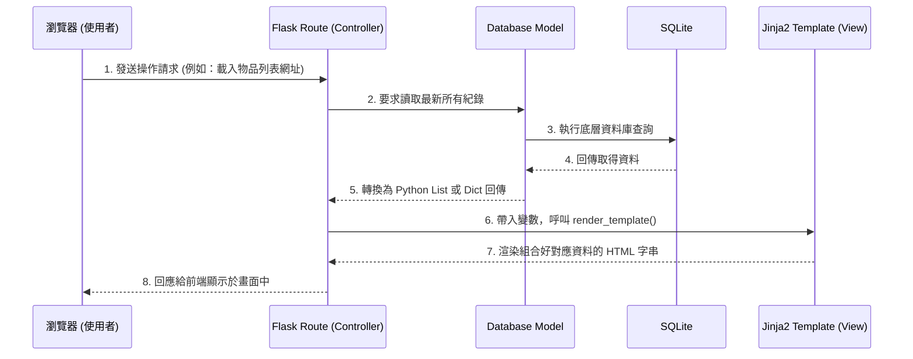

# 系統架構設計文件 - 校園遺失物查詢系統

本文件根據產品需求文件（PRD）中的功能需求，定義系統的技術選型、資料夾結構與元件間的互動關係。

## 1. 技術架構說明

本系統選用輕量級的 Web 技術堆疊，適合快速進行概念驗證（MVP）與開發：

* **後端架構**：Python + Flask
  * **原因**：Flask 是輕量彈性的微框架，撰寫路由與邏輯十分直覺，對於功能明確的校園遺失物查詢系統來說，是非常高效合適的選擇。
* **模板引擎**：Jinja2
  * **原因**：本系統採用 Server-Side Rendering（SSR），即伺服器渲染。Flask 將後端資料經過處理後，與 HTML 也就是 Jinja2 模板結合，由後端直接產出最終畫面給瀏覽器。這樣能節省專門建置 API 以及前端框架（如 React / Vue）的開發時間。
* **資料庫**：SQLite
  * **原因**：內建於 Python 中，免去架構獨立 Database Server 的麻煩。資料即檔案，用於紀錄初期的遺失物清單綽綽有餘。

### Flask MVC 模式說明
雖然 Flask 未強制規範，但我們會在資料夾結構上導入類 MVC 原則，確保維護容易：
* **Model（模型）**：專門與 SQLite 資料庫溝通，封裝 SQL 語法或 ORM 邏輯，處理資料的讀寫功能。
* **View（視圖）**：為 Jinja2 的 HTML 模板所在地，全權負責接收到的資料該長什麼樣子與介面呈現。
* **Controller（控制器）**：對應 Flask 的 Routes (路由函數)。負責接收使用者的網址請求，向 Model 調用資料後，送交給 View 進行渲染。

## 2. 專案資料夾結構

以下為建議的系統目錄設計：

```text
web_app_development/
├── app/                  # 應用程式主區域
│   ├── __init__.py       # - 初始化 Flask app、載入設定
│   ├── models/           # [Models] 資料層
│   │   └── items.py      #   - 對應遺失物與拾獲物的操作（CRUD）
│   ├── routes/           # [Controllers] 路由層
│   │   ├── main.py       #   - 首頁與共用邏輯路由
│   │   ├── lost.py       #   - 遺失物相關路由（登記、搜尋）
│   │   └── found.py      #   - 拾獲物相關路由（登記）
│   ├── templates/        # [Views] 介面層 (Jinja2 HTML)
│   │   ├── base.html     #   - 母版/共用樣式 (導覽列、頁尾)
│   │   ├── index.html    #   - 網站首頁與物件總覽清單
│   │   ├── form.html     #   - 新增/編輯物件共用表單
│   │   └── detail.html   #   - 物件獨立詳細資訊頁 (含聯絡方式)
│   └── static/           # 靜態資源
│       ├── css/
│       │   └── style.css #   - 共用樣式與排版定義
│       ├── js/
│       │   └── main.js   #   - 前端輔助腳本 (例如：確認刪除提示)
│       └── uploads/      #   - 使用者上傳之實體物品照片存放路徑
├── instance/             
│   └── database.db       # SQLite 實體資料庫檔案 (不進版控設定)
├── docs/                 # 系統專案文件
│   ├── PRD.md            
│   └── ARCHITECTURE.md   # 本檔案
├── requirements.txt      # Python 依賴套件說明檔案
└── run.py                # 專案程式啟動口 (入口點)
```

## 3. 元件關係圖

以下展示各軟體元件在系統內是如何互動的：



## 4. 關鍵設計決策

1. **傳統 SSR 架構而非 SPA**
   系統要求快速開發且不需要複雜的單頁面狀態操作（SPA），採用 Flask 原生搭配 Jinja2 渲染是最合理的做法，團隊成員皆能輕易上手維護。
2. **依實體職責切割 Routes 路由**
   因未來可能會有擴增功能（例如：使用者系統），因此在路由層將它拆分成 `main`, `lost`, `found`，由 Flask 的 Blueprint 功能統整引入，以避免 `run.py` 或單一檔案過於龐大肥重。
3. **圖片檔案本地化存儲**
   針對遺失物的圖片上傳功能不外接雲端存儲平台，直接放入 `app/static/uploads/` 內，方便一體化執行與管理。並在後端設定檔案大小限制以控管儲存空間。
4. **Jinja2 版型繼承**
   使用 `base.html` 來維護共通的 Header (找東西、撿東西之導覽列) 與 Footer，後續新增其他頁面只需修改 `` 部分，落實 DRY (Don't Repeat Yourself) 原則。
