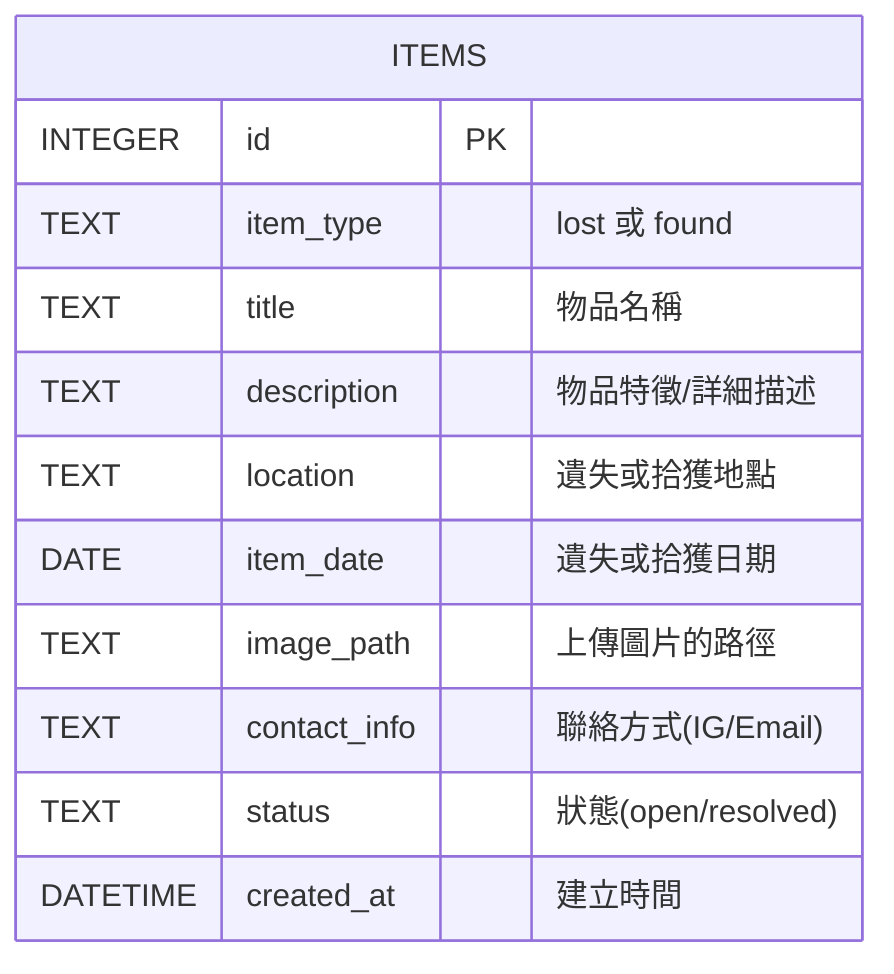

# 資料庫設計文件 (DB Design)

本文件描述校園遺失物查詢系統的 SQLite 資料庫結構設計，主要用於儲存所有的遺失物與拾獲物紀錄。

## 1. 實體關係圖 (ER Diagram)

為了簡化系統架構與後續的配對推薦邏輯，我們採用單一資料表 `items` 來儲存所有的遺失與拾獲紀錄。系統會透過 `item_type` 欄位來區辨該紀錄是「遺失物 (lost)」還是「拾獲物 (found)」。

## 2. 資料表明細

### `items` 表
此表儲存所有平台上登記的物品資訊。

| 欄位名稱 | 型別 | 必填 | 預設值 | 說明 |
| :-- | :-- | :-- | :-- | :-- |
| `id` | INTEGER | 是 | (Auto Increment) | Primary Key。唯一識別碼。 |
| `item_type` | TEXT | 是 | - | 紀錄這是一筆 `lost` (遺失物) 或 `found` (拾獲物)。 |
| `title` | TEXT | 是 | - | 物品的名稱或簡單標題 (例如：黑色 iPhone 13)。 |
| `description` | TEXT | 否 | - | 詳細的特徵描述。 |
| `location` | TEXT | 是 | - | 遺失的可能地點，或是撿到時的地點。 |
| `item_date` | DATE | 否 | - | 遺失或拾獲的具體日期。 |
| `image_path` | TEXT | 否 | - | 實體物品照片上傳後，存放於本地的相對/絕對路徑。 |
| `contact_info` | TEXT | 否 | - | 失主或拾獲者的聯絡方式（例如：IG 帳號或 Email）。 |
| `status` | TEXT | 是 | `open` | 案件狀態：`open` (尋找中/招領中) 或 `resolved` (已結案/已尋回)。 |
| `created_at` | DATETIME | 是 | CURRENT_TIMESTAMP | 該筆紀錄寫入資料庫的系統建立時間。 |

## 3. SQL 建表語法與 Model

具體的 SQL 建立語法（DDL）已實作並存放於 `database/schema.sql`：
- 以 `sqlite3` 執行該檔案即可建立空白結構。

對應的資料庫模型 (Model) 操作皆封裝於 `app/models/items.py`，提供 `create_item`, `get_all_items`, `get_item_by_id`, `update_item_status`, `delete_item` 等 CRUD 介面。
