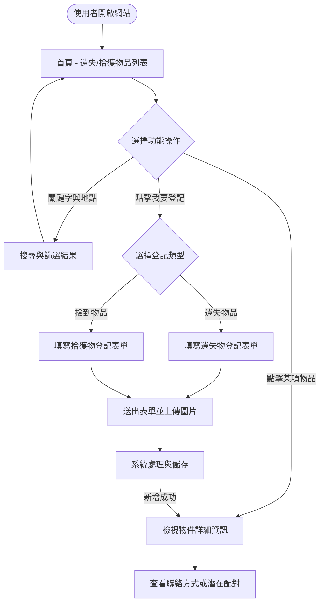
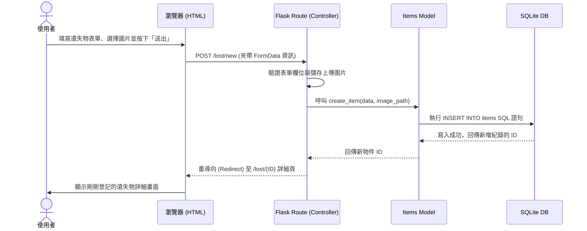

# 流程圖設計文件 - 校園遺失物查詢系統

本文件依據 PRD 與系統架構文件的規劃，從「使用者操作路徑」及「系統資料流」兩個視角，視覺化呈現校園遺失物系統的運作方式。

## 1. 使用者流程圖（User Flow）

此流程圖描述使用者從進入網站開始，可能的操作情境與畫面跳轉路徑。

## 2. 系統序列圖（Sequence Diagram）

此序列圖描述「使用者登記遺失物」時，背後跨元件（Browser, Flask Route, Model, SQLite）的完整資料流與系統互動狀況。

## 3. 功能清單對照表

根據 PRD 定義的主要功能，對應未來的 URL 路由設計與 HTTP 方法，作為後續 `api-design` 與開發實作的參考依據。

| 功能名稱 | 說明 | 建議 URL 路徑 | HTTP 方法 |
| --- | --- | --- | --- |
| **首頁列表瀏覽** | 檢視所有最新的遺失及拾獲物品清單 | `/` | GET |
| **搜尋篩選功能** | 透過表單傳遞關鍵字或篩選地點並顯示結果 | `/search` | GET |
| **新增遺失物(頁面)** | 顯示遺失物填寫表單畫面 | `/lost/new` | GET |
| **新增遺失物(送出)** | 將上述表單的資料與圖片送往後端儲存 | `/lost/new` | POST |
| **新增拾獲物(頁面)** | 顯示撿到物品的填寫表單畫面 | `/found/new` | GET |
| **新增拾獲物(送出)** | 將上述表單的資料與圖片送往後端儲存 | `/found/new` | POST |
| **查看物品細節** | 檢視特定遺失或拾獲物件的圖文與聯絡資訊 | `/items/<int:id>` | GET |
| **自動配對提示** | 系統根據該物件之特徵，推薦潛在匹配的另一方紀錄 | `/items/<int:id>/matches` | GET |
